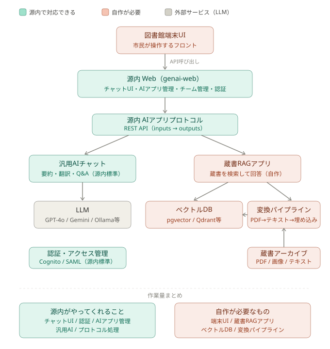

# ユースケース：図書館蔵書AIチャットシステム

- **作成日:** 2026-07-08
- **ステータス:** 検討中
- **関連調査:** 
  - [AIアプリAPI仕様](../02_research/ai-app-api-spec.md)
  - [Lawsy深掘り](../02_research/lawsy-deep-dive.md)

---

## ユースケース概要

蔵書がアーカイブされている図書館において、市民が図書館の端末上でAIとLLM会話できるシステム。

市民は読みたい内容・テーマを自然言語で入力し、AIが蔵書の中から関連する情報を検索・要約して回答する。

---

## システム構成図



## システム構成（テキスト版）

```
[ 市民 ]
    ↓ 自然言語で入力
[ 図書館端末UI ]          ← 自作 or 源内WebをそのままUI利用
    ↓ API呼び出し
[ 源内 Web（genai-web）]  ← そのまま利用可能
    ↓ 源内プロトコル（REST API）
    ├── [ 汎用AIチャット ]          ← 源内標準（要約・翻訳等）
    └── [ 蔵書RAGアプリ ]           ← 自作が必要
              ↓
        [ ベクトルDB ]              ← 自作が必要（pgvector / Qdrant等）
              ↑
        [ 変換パイプライン ]         ← 自作が必要
              ↑
        [ 蔵書アーカイブ ]          ← 既存資産（PDF / 画像 / テキスト）
              ↓（LLM呼び出し）
        [ LLM ]                     ← 外部サービス or ローカル
```

---

## 源内で対応できる部分

| 機能 | 対応状況 | 備考 |
|---|---|---|
| チャットUI | ✅ 源内標準 | genai-webのUIをそのまま使用 |
| 認証・アクセス管理 | ✅ 源内標準 | Cognito / SAML対応済み |
| AIアプリ管理（GUI登録） | ✅ 源内標準 | 蔵書RAGアプリをGUIで追加できる |
| 汎用AI（要約・翻訳等） | ✅ 源内標準 | チャット・要約・校正など |
| チーム・権限管理 | ✅ 源内標準 | 司書向け管理者権限等 |
| AIアプリプロトコル | ✅ 源内標準 | REST API準拠すれば自作アプリを追加できる |

---

## 自作が必要な部分

### 1. 蔵書RAGアプリ（核心）

源内プロトコルに準拠したREST APIを自作する。

**最小実装例（Python + FastAPI）**

```python
from fastapi import FastAPI

app = FastAPI()

@app.post("/")
def search_books(req: dict):
    question = req["inputs"]["input_text"]
    
    # ① ベクトルDBから関連蔵書を検索
    docs = vector_search(question)
    
    # ② LLMで回答生成（出典付き）
    answer = llm.generate(
        question=question,
        context=docs,
        prompt="以下の蔵書を参考に回答してください。出典も明記してください。"
    )
    
    return {"outputs": answer}
```

**源内Webへの登録設定（JSON）**

```json
{
  "input_text": {
    "title": "読みたい内容・テーマ",
    "desc": "探している本の内容や知りたいテーマを入力してください",
    "type": "textarea",
    "required": true
  },
  "conversation_history": {
    "title": "会話履歴",
    "type": "textarea"
  }
}
```

---

### 2. ベクトルDB

蔵書をAIが検索できる形で格納するデータベース。

| 選択肢 | 特徴 | 向いているケース |
|---|---|---|
| **pgvector** | PostgreSQL拡張、シンプル | 小〜中規模、PostgreSQL既存環境 |
| **Qdrant** | 高性能・Rust製、REST API | 中〜大規模、Proxmox環境 |
| **Chroma** | Python親和性高い、軽量 | 試作・小規模 |
| **BigQuery** | Lawsyと同じ構成 | GCP環境 |

---

### 3. 変換パイプライン

蔵書のデータをベクトルDBに取り込む前処理。

```
蔵書データ（PDF / 画像 / テキスト）
    ↓
① テキスト抽出
   - PDF → pdfminer / pymupdf
   - 画像 → OCR（Tesseract / Google Vision API）

    ↓
② チャンク分割
   - 章・節単位、または固定文字数（500〜1000文字）

    ↓
③ 埋め込みベクトル生成
   - OpenAI Embeddings / Vertex AI Embeddings / ローカルモデル

    ↓
④ ベクトルDBへ格納
   - タイトル・著者・ページ等のメタデータも一緒に保存
```

---

### 4. 図書館端末UI（任意）

源内WebのUIをそのまま使えばほぼ不要。市民向けに操作を大幅に簡略化したい場合のみ追加で作る。

| アプローチ | 工数 | 向いているケース |
|---|---|---|
| 源内WebのUIをそのまま使用 | 低 | まず動かしたい段階 |
| 源内Webを軽くカスタマイズ | 中 | 図書館ロゴ・色変更程度 |
| 別途専用UIを自作 | 高 | 操作を大幅に簡略化したい場合 |

---

## Proxmox環境での推奨構成

```
Proxmox LXC/VM
├── genai-web（Docker or AWS）
│     └── 蔵書RAGアプリをGUIから登録
│
├── 蔵書RAGアプリ（FastAPI コンテナ）
│     ├── PORT: 8001
│     └── 源内プロトコル準拠
│
├── Qdrant（ベクトルDBコンテナ）
│     └── PORT: 6333
│
├── Ollama（ローカルLLMコンテナ）
│     ├── PORT: 11434
│     └── モデル: llama3.1:8b or qwen2.5:7b
│
└── 変換パイプライン（定期バッチ / Pythonスクリプト）
      └── 新規蔵書追加時に手動 or 自動実行
```

---

## 実装ロードマップ

| フェーズ | 内容 | 難易度 |
|---|---|---|
| **Phase 1** | 変換パイプラインを作り、サンプル蔵書をQdrantに格納 | ★★☆ |
| **Phase 2** | 最小RAGアプリを作り、源内Webに登録して動作確認 | ★★☆ |
| **Phase 3** | 会話履歴対応・出典表示・精度改善 | ★★★ |
| **Phase 4** | 図書館端末UI作成（必要なら） | ★★★ |

---

## 技術的な課題・未確認事項

> **TODO:** 蔵書のOCR精度をどう担保するか検討する（特に古い資料）
> **TODO:** チャンク分割の最適サイズを検証する（書籍の場合）
> **TODO:** 出典（書籍名・ページ数）の表示フォーマットを決める
> **TODO:** 著作権・利用規約の確認（アーカイブ蔵書のデジタル利用条件）
> **TODO:** Proxmox環境でのgenai-webのセルフホスト可否を検証する
> **TODO:** Ollamaでの回答品質と外部LLMの品質差を比較検証する
